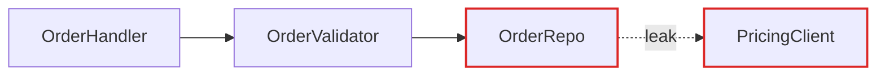
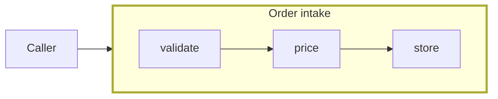

# Report Format

The architectural review's report is Markdown, written into the issue it publishes: the plan's top issue, or the idea issue. GitHub renders Mermaid in a fenced `mermaid` block, so the diagrams live where the issue is read. Write no file, and open nothing.

The report is one candidate's card: the top recommendation's. The candidates that weren't chosen get no card.

## Candidate card

The diagrams carry the weight. Prose is sparse, plain, and uses the glossary terms (from the `/thirdshift:codebase-design` skill) without ceremony.

```md
**Strength**: Strong · **Dependencies**: in-process

**Files**: `src/order/handler.rs`, `src/order/validator.rs`, `src/order/repo.rs`

**Before**

<a mermaid block>

**After**

<a mermaid block>

**Problem**: one sentence. What hurts.

**Solution**: one sentence. What changes.

**Wins**

- Tests hit one interface
- Pricing logic stops leaking

> [!WARNING]
> Contradicts ADR-0007, but worth reopening because…
```

- **Strength**: the recommendation strength (`Strong`, `Worth exploring` or `Speculative`), plus the dependency category (`in-process`, `local-substitutable`, `ports & adapters`, `mock`). On an idea issue, add one line saying what stopped it being `Strong`.
- **Files**: a list in code spans. The report is the one place file paths belong; the rest of a Spec or Ticket leaves them out.
- **Before / After diagram**: the centrepiece. One Mermaid block each, the same modules in both so the eye can compare. See patterns below.
- **Problem**: one sentence. What hurts.
- **Solution**: one sentence. What changes.
- **Wins**: bullets, ≤6 words each. e.g. "Tests hit one interface", "Pricing logic stops leaking", "Delete 4 shallow wrappers".
- **ADR callout** (if applicable): one line in a `> [!WARNING]` alert.

No paragraphs of explanation. If the diagram needs a paragraph to be understood, redraw the diagram.

## Diagram patterns

Pick the pattern that fits the candidate. Before and after use the same pattern.

### Flowchart (the workhorse for dependencies / call flow)

Use a Mermaid `flowchart` when the point is "X calls Y calls Z, and look at the mess." Style with `classDef` to colour leakage edges red and give the deep module a thick border. A dashed edge is leakage across a seam.

````md

````

### Sequence diagram (good for round-trips)

Use a `sequenceDiagram` for "before: 6 round-trips; after: 1."

### Subgraph collapse (good for layered shallowness and call-graph collapse)

Before: the shallow modules as separate nodes, each call an edge. After: one `subgraph` labelled with the consolidated responsibility, the now-internal calls inside it, and one edge in from the caller.

````md

````

## Style guidance

- Keep each diagram small: a dozen nodes at most. Leave out whatever doesn't change between before and after.
- Colour sparingly: red for leakage, a thick border for the deep module, nothing else.
- Label nodes with the module's name in the domain language, not a sentence.
- Check that each block is valid Mermaid before publishing: a diagram that doesn't render is worse than none.

## Tone

Plain English, concise, but the architectural nouns and verbs come straight from the `/thirdshift:codebase-design` skill. Concision is not an excuse to drift.

**Use exactly:** module, interface, implementation, depth, deep, shallow, seam, adapter, leverage, locality.

**Never substitute:** component, service, unit (for module) · API, signature (for interface) · boundary (for seam) · layer, wrapper (for module, when you mean module).

**Phrasings that fit the style:**

- "Order intake module is shallow: interface nearly matches the implementation."
- "Pricing leaks across the seam."
- "Deepen: one interface, one place to test."
- "Two adapters justify the seam: HTTP in prod, in-memory in tests."

**Wins bullets** name the gain in glossary terms: *"locality: bugs concentrate in one module"*, *"leverage: one interface, N call sites"*, *"interface shrinks; implementation absorbs the wrappers"*. Don't write *"easier to maintain"* or *"cleaner code"*, because those terms aren't in the glossary and don't earn their place.

No hedging, no throat-clearing, no "it's worth noting that…". If a sentence could be a bullet, make it a bullet. If a bullet could be cut, cut it. If a term isn't in the `/thirdshift:codebase-design` glossary, reach for one that is before inventing a new one.
